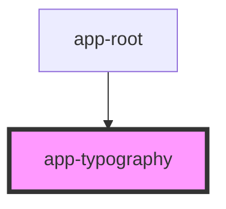

# app-paper

<!-- Auto Generated Below -->

## Properties

| Property  | Attribute | Description | Type                                                                                                                                                               | Default     |
| --------- | --------- | ----------- | ------------------------------------------------------------------------------------------------------------------------------------------------------------------ | ----------- |
| `variant` | `variant` |             | `"body1" \| "body2" \| "d1" \| "d2" \| "d3" \| "h1" \| "h2" \| "h3" \| "menuTitle" \| "n1" \| "n2" \| "n3" \| "n4" \| "n5" \| "n6 " \| "subtitle1" \| "subtitle2"` | `undefined` |

## Dependencies

### Used by

 - [app-root](../app-root)

### Graph

----------------------------------------------

*Built with [StencilJS](https://stenciljs.com/)*
